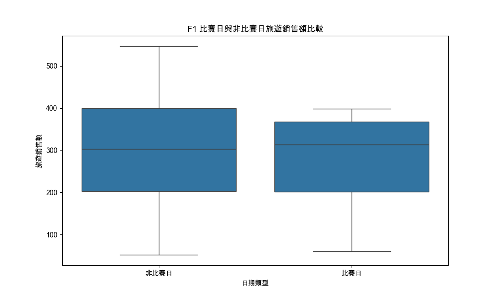
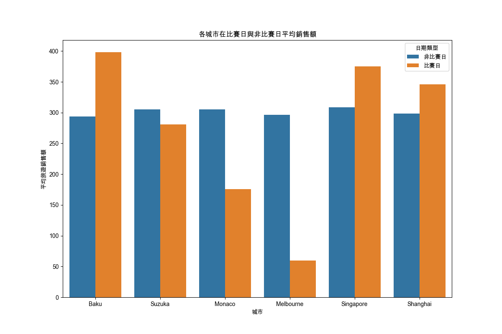
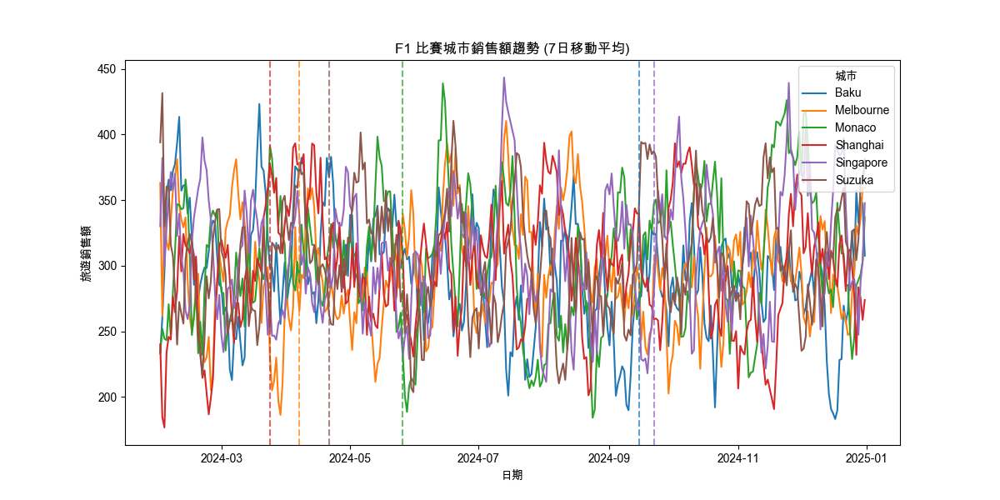
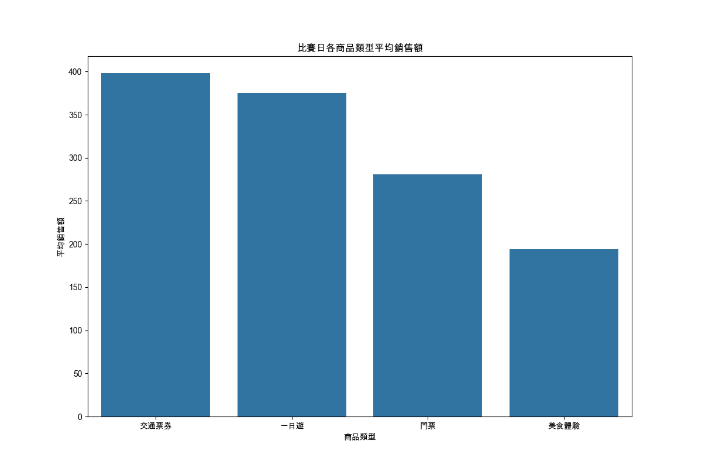

# F1-analysis-project
# F1 賽事對城市旅遊銷售額影響分析

## 專案結構
```
F1_Travel_Analysis/
├── f1_analysis_script.py  # 主要程式碼
├── f1_travel_analysis_data.csv  # 整合後的每日數據 (輸出)
├── f1_weekly_sales_by_city.csv  # 整合後的每週數據 (輸出)
└── README.md
```

## 專案介紹
本專案旨在運用數據分析，洞察 **一級方程式（Formula 1）賽事** 對旅遊市場的影響，並為旅遊電商平台提供營運建議。

## 使用工具
- **資料爬蟲**: Python（pandas, numpy）
- **數據分析與與視覺化**: python (matplotlib, seaborn)

### 專案目標
* **市場趨勢洞察**：透過資料爬蟲與趨勢分析，預測 F1 賽事前後，不同類型旅遊商品（如門票、一日遊、美食體驗）的市場熱度與消費者需求變化。
* **優化產品策略**：根據分析結果，提供具體的產品組合建議，協助團隊更有效地配置資源，推出符合市場需求的主題旅遊商品。
* **支持 AI 推薦系統**：專案產出的數據洞察，可作為 AI 推薦系統的訓練與優化依據，讓平台能更精準地向使用者推薦商品，從而提升轉換率與使用者體驗。

## 專案內容
### 資料準備與整合
- **爬取 F1 賽程資料**: 使用 Python 爬蟲工具，從維基百科網頁中爬取旅遊商品、評論、熱度等公開數據。
- **數據資料前處理**: 對爬取到的非結構化數據進行清洗、轉換與整合，建立可供分析的資料集。

### 核心 Python 數據模擬與數據分析
- **生成模擬旅遊銷售數據**：為了進行分析，利用生成模擬旅遊數據（numpy）函式，為幾個 F1 舉辦城市（例如：上海、摩納哥、新加坡等）在 2024 年的每一天，生成模擬的旅遊銷售數據，這些數據包含銷售額、評分和商品類型。 > **[點此查看 Python 腳本](sql/project_analysis.sql)**
- **時間序列分析**：分析賽事前後，各類商品的點擊率或銷售量變化。
- **相關性分析**：探討商品類型與使用者熱度之間的關聯。

### 運用 Python 套件將分析成果視覺化
- **利用 Matplotlib 和 Seaborn 繪製多張圖表**:從不同面向來分析 F1 賽事帶來的影響：
- **計算 F1 比賽日與非比賽日的平均銷售額，並計算比賽日銷售額的增長百分比**：繪製 盒形圖（Boxplot），直觀地比較比賽日和非比賽日的銷售額分布。
- **長條圖**：顯示每個城市在比賽日與非比賽日各自的平均銷售額。
- **趨勢分析**：程式計算了每個城市旅遊銷售額的 7 日移動平均線，繪製出銷售額的趨勢圖。
- **圖中用虛線標示出每個城市的 F1 比賽日**：可以觀察銷售額在賽事前後的變化趨勢。
- **城市影響力比較**：計算 F1 賽事對每個城市銷售額的提升百分比，並用長條圖展示出來，比較 F1 對不同城市的影響大小。
- **熱門商品分析**：分析並繪製長條圖，顯示在比賽日期間，哪一種商品類型（如：門票、一日遊、交通票券）的平均銷售額最高，藉此找出受賽事影響最大的旅遊商品。

### 額外產出
- **每週銷售額報表**：將每日數據匯總成每週的銷售額，並標記出「F1 比賽週」，將結果儲存成（f1_weekly_sales_by_city.csv）。
> **[點此查看 CSV 檔案]()**
- **數據整合**：將 F1 賽程表和模擬旅遊數據合併，並標記出哪些日期是 F1 的「比賽日」。最後，將整合後的資料儲存為一個 CSV 檔案（f1_travel_analysis_data.csv），以便後續分析。
> **[點此查看 CSV 檔案]()**

### 洞察與分析
**1. F1 比賽日與非比賽日旅遊銷售額比較（盒形圖）**
- **F1 比賽日對銷售額有正向影響**：從盒形圖可以看出，「比賽日」的銷售額中位數（盒子的中間線）略高於「非比賽日」。「比賽日」銷售額的分布範圍（箱子）也明顯高於「非比賽日」，這表示在比賽日期間，旅遊銷售額有較高的機會達到更高水平。


**2. 各城市在比賽日與非比賽日平均銷售額（長條圖）**
- **F1 賽事對各城市的影響不一**：
  - **正面影響顯著的城市**：Baku、Singapore 和 Shanghai 在比賽日的平均銷售額明顯高於非比賽日。這顯示 F1 賽事在這些城市對旅遊經濟有較大的刺激作用。
  - **負面影響或無影響的城市**：Melbourne 和 Monaco 的比賽日銷售額反而低於非比賽日。這可能是由於賽事期間的交通管制、高昂成本或遊客行為模式不同所導致。
  - **結論**：F1 賽事對旅遊銷售額的影響具有城市特異性，並非所有城市都能從中獲益。


**3. F1 賽事對各城市旅遊銷售額的提升百分比（長條圖）**
  - **量化了各城市的影響**：Baku、Singapore 和 Shanghai 的銷售額增長百分比為正值，其中 Baku 增長率最高，顯示其旅遊業在 F1 賽事期間受到的提振最為強勁。Melbourne、Monaco 和 Suzuka 的銷售額增長百分比為負值，其中 Melbourne 降幅最大。這再次印證了在這些城市，F1 賽事似乎未能有效提升旅遊銷售額，甚至可能因某些原因（如人潮集中在賽道周邊，而非一般觀光區域）導致整體銷售額下降。
- **結論**：這張圖表清晰地顯示了哪些城市是 F1 賽事的主要受益者，而哪些城市可能需要重新評估其旅遊行銷策略。


**4. F1 比賽城市銷售額趨勢（7日移動平均）**
  - **賽事前後的熱度波動**：這張圖顯示了各城市在一年中銷售額的起伏。雖然趨勢線波動劇烈，但在每個城市對應的虛線（代表比賽日）附近，可以看到銷售額有時會出現小幅高峰。由於模擬數據的隨機性，趨勢圖的變化沒有非常規律，但可以觀察到一些城市（例如：Baku 的第一個虛線）周圍的銷售額確實有上升。
  - **結論**：這張圖為我們提供了一個更宏觀的時間軸視角，來觀察賽事在全年旅遊銷售額中的影響，但需要更長期的真實數據來做出更精確的判斷。


**5. 比賽日各商品類型平均銷售額（長條圖）**
  - **交通票券和一日遊最受歡迎**：在 F1 比賽日期間，交通票券 和 一日遊 這兩種商品類型的平均銷售額最高。門票 和 美食體驗 的銷售額則相對較低。
  - **結論**：這顯示 F1 觀賽者或隨之而來的遊客，在比賽日期間更傾向於購買與交通、行程規劃相關的服務，這可能是為了方便前往賽道或在賽事之餘快速體驗城市精華。對於行銷團隊來說，這是一個重要的市場洞察，可以作為產品組合和行銷推廣的參考。


### 專案成果
- **商業洞察**: 透過數據分析與彙整，能夠量化活動賽事對旅遊銷售的影響，藉由深入的市場分析發現了熱門商品類型與趨勢觀察。
- **技術能力**: 本專案展示了我能夠進行數據整合與進行自動化報告，能夠透過 Python 進行數據處理及視覺化分析能力，產出多張清晰的圖表，包括箱型圖、長條圖和趨勢線圖，直觀地呈現了不同層面的分析結果，使團隊能快速理解專案發現。
